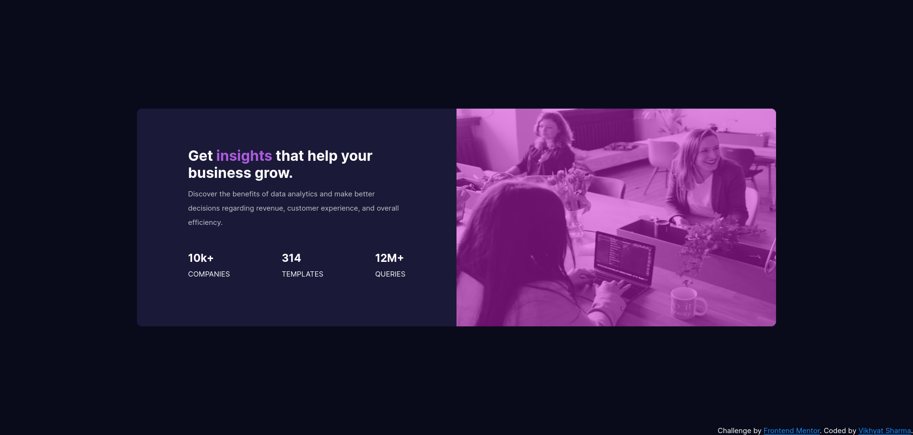

# Frontend Mentor - Stats preview card component solution

This is a solution to the [Stats preview card component challenge on Frontend Mentor](https://www.frontendmentor.io/challenges/stats-preview-card-component-8JqbgoU62). Frontend Mentor challenges help you improve your coding skills by building realistic projects. 

## Table of contents

- [Overview](#overview)
  - [The challenge](#the-challenge)
  - [Screenshot](#screenshot)
  - [Links](#links)
- [My process](#my-process)
  - [Built with](#built-with)
  - [What I learned](#what-i-learned)
  - [Continued development](#continued-development)
  - [Useful resources](#useful-resources)
- [Author](#author)


## Overview

### The challenge

Users should be able to:

- View the optimal layout depending on their device's screen size

### Screenshot




### Links

- Solution URL: [Add solution URL here](https://your-solution-url.com)
- Live Site URL: [Add live site URL here](https://your-live-site-url.com)

## My process

### Built with

- Semantic HTML5 markup
- CSS custom properties
- Flexbox

### What I learned

I have just started with learning web development and I learned a lot of stuff by completing this project. But there are some things I thought were not possible before are:
- Adding a different color to a background image

```html
<section id="display-image">
  <div id="image-overlay"></div>
</section> 
```

```css
#display-image {
    background-image: url('images/image-header-desktop.jpg');
    background-size: 100% 100%;
}

#image-overlay {
    background-color: rgba(205, 30, 210, 0.5);
}

```

### Continued development

There are a lot of things that I would like to refine but the main areas that I would focus on would be:
- Flexbox
- Creating responsive images

### Useful resources

- [Flexbox: CSS-TRICKS](https://css-tricks.com/snippets/css/a-guide-to-flexbox/) - The pictorial representation of the different properties of flexbox in this guide greatly helped in their understandings.

## Author

- Frontend Mentor - [@VikhyatSharma17](https://www.frontendmentor.io/profile/VikhyatSharma17)
- Twitter - [@Vikhyat1701](https://twitter.com/Vikhyat1701)
